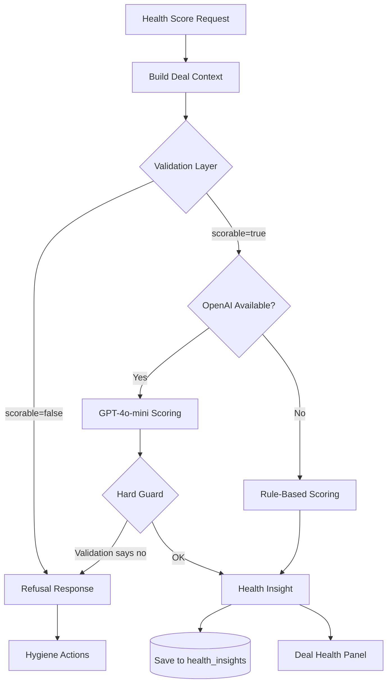

# AI Insight Layer

## Design Philosophy

> The LLM is the last step, not the first.

A naive co-pilot sends dirty CRM data straight to an LLM and gets a confident-but-wrong forecast. Deal Radar inserts a **deterministic validation gate** before any model call, and a **hard guard** after.

## Pipeline Architecture



## Step 1: Context Retrieval

When scoring deal `D-9901`, the system assembles:

```typescript
{
  deal: { stage, amount, close_date, activity_count, is_source_of_truth, ... },
  events: [ last 30 processed events for this deal ],
  notes: [ last 20 deal notes ]
}
```

**No vector search.** Context is small enough to inline. For deals with hundreds of notes across a 9-month cycle, production would use embedding-based retrieval with temporal decay.

## Step 2: Methodology Selection

**Current:** Hardcoded MEDDICC.

**Production design:**
```
IF deal.stage IN [Discovery, Qualification] → MEDDICC (qualification-focused)
IF deal.stage = Negotiation → MEDDICC + competitive analysis
IF deal.stage = Closed-Won → win analysis (not scoring)
IF deal.amount > $1M → MEDDICC + account planning
```

Methodology selection would be a deterministic rules engine, not an LLM decision.

## Step 3: Validation Layer (Anti-Hallucination Core)

This is the most important component. It runs **before** any LLM call.

### Checks Performed

| Check | Condition | Result |
|-------|-----------|--------|
| Missing stage | `deal.stage IS NULL` | Not scorable |
| Missing amount | `deal.amount IS NULL` | Not scorable |
| Missing close date | `deal.close_date IS NULL` | Not scorable |
| Zero activity | `activity_count = 0` | Quality issue |
| Closed-Won, no activity | stage=Closed-Won AND activity=0 | **Hard refuse** |
| Stage/close mismatch | Discovery + close < 14 days | Quality issue |
| Stale activity | last activity > 90 days ago | Quality issue |
| Not source of truth | `is_source_of_truth = false` | Quality issue |
| MEDDICC fields | keyword search in notes/payloads | Missing fields list |

### Scoring Decision

```
scorable = (
  no missing mandatory fields
  AND no hard-refuse quality issues (Closed-Won + zero activity)
)
```

### Example: D-9903 (from the brief)

```
Deal: D-9903
Stage: Closed-Won
Amount: $250,000
Activity Count: 0
Last Activity: NULL

Validation Result:
  scorable: false
  data_quality_issues: [
    "No activity history (no emails, calls, or meetings logged)",
    "Deal marked Closed-Won but has zero logged activities — cannot verify win legitimacy"
  ]
  hygiene_actions: [
    "Log at least one customer interaction (email, call, or meeting)"
  ]
  summary: "Cannot score D-9903: insufficient or unreliable data."
```

The system **refuses** rather than inventing a win analysis.

## Step 4: LLM Scoring (Optional Enhancement)

Only reached if validation passes AND `OPENAI_API_KEY` is set.

### Prompt Design

**System prompt constraints:**
- MUST only use provided structured data
- MUST NOT invent activities, contacts, or metrics
- MUST set `scorable: false` if data is insufficient
- MUST return valid JSON

**User prompt includes:**
- Full deal snapshot
- Recent events (last 10)
- Recent notes (last 5)
- Pre-validation flags (so the LLM knows what's already flagged)

**Temperature:** 0.1 (minimal creativity)

### Hard Guard

Even if the LLM returns `scorable: true` for a deal that failed validation, the code overrides:

```typescript
if (!validation.scorable) {
  return ruleBasedScore(ctx, validation); // LLM output discarded
}
```

## Step 5: Rule-Based Fallback

When no API key is configured, or LLM call fails:

```
Base score from stage:
  Discovery: 40, Qualification: 55, Negotiation: 75, Closed-Won: 95, Closed-Lost: 10

Adjustments:
  Recent activity (≤7 days): +10
  Activity (≤30 days): +5
  Stale activity (>60 days): -15
  Strong engagement (≥5 activities): +5
  Minimal activity (≤1): -10
  Past close date in Negotiation: -20
  Close within 2 weeks in Negotiation: +5

Clamp to [0, 100]
Risk: ≥70 low, ≥45 medium, <45 high
```

This ensures the demo works without an OpenAI key.

## Step 6: Hygiene Enforcer (Expert Level)

When scoring is refused, the response includes **actionable hygiene prompts**:

```json
{
  "scorable": false,
  "hygiene_actions": [
    "Log at least one customer interaction (email, call, or meeting)",
    "Document Economic Buyer identified in deal notes",
    "Document Champion identified in deal notes",
    "Resolve duplicate deal records and mark the canonical one as source of truth"
  ]
}
```

**Production loop:** These actions would tie back to the live stream — when the rep logs the missing activity, the next event triggers re-scoring automatically.

## Memory & Context Across Long Sales Cycles

**Current (take-home):** Stateless scoring. Each request builds fresh context from DB.

**Production design:**

```
Deal Memory Store:
  ├── Structured state (Postgres deals table) — always current
  ├── Activity timeline (processed_events) — full history
  ├── Notes corpus (deal_notes) — searchable
  ├── Previous insights (health_insights) — trend over time
  └── Embedding index (vector DB) — semantic search over notes

Scoring request:
  1. Load structured state
  2. Retrieve relevant notes via embedding similarity (top-k)
  3. Include last N insights for trend context ("score dropped from 72 to 45")
  4. Validate → Score → Persist
```

Memory is **per-deal**, not global. There is no cross-deal context (each deal is independent).

## Anti-Hallucination Strategy Summary

| Level | Mechanism | Implementation |
|-------|-----------|---------------|
| Junior (avoided) | Prompt-only | ❌ Not used |
| Senior | Validation gate | ✅ `validateDealForScoring()` |
| Expert | Hygiene enforcer | ✅ `hygiene_actions[]` in refusal response |
| Expert+ | Hard guard | ✅ Code overrides LLM if validation failed |
| Expert+ | Live loop | ✅ At-risk panel refreshes as events arrive; auto re-score on hygiene fix not wired |

## API Endpoints

| Endpoint | Purpose |
|----------|---------|
| `GET /api/deals/:id/health` | Score a single deal |
| `GET /api/insights/at-risk` | Score all open deals, return non-low-risk |

## Cost & Latency

| Path | Latency | Cost |
|------|---------|------|
| Rule-based | ~50ms | $0 |
| LLM (GPT-4o-mini) | ~1-2s | ~$0.001 per score |

For a pipeline of 100 deals, full at-risk scan with LLM costs ~$0.10. Validation layer filters out unscorable deals before any LLM call, saving cost.
