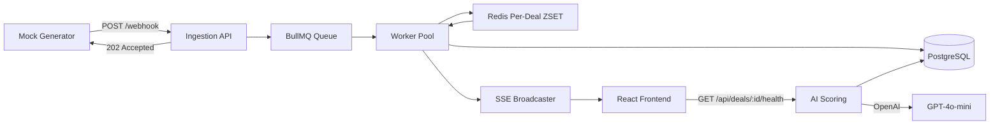

# Architecture

## System Overview

Deal Radar is a three-layer system where events flow unidirectionally from ingestion through processing to the UI, with the AI layer reading from persisted state.



## Layer 1 — Backend

### Ingestion (Non-Blocking)

```
POST /webhook/events
  ├── Validate payload (Zod schema)
  ├── Enqueue to BullMQ (jobId = event_id for dedup)
  └── Return 202 Accepted immediately
```

Ingestion never waits for processing. The webhook handler completes in <5ms regardless of queue depth.

### Queue Architecture

**Technology:** BullMQ on Redis

**Why BullMQ over RabbitMQ:**
- Native TypeScript support
- Built-in job deduplication via `jobId`
- Bull Board for observability (required by brief)
- Simpler ops for a take-home (single Redis instance)

**Per-Deal Ordering Strategy:**

Events for the same `deal_id` must process in `occurred_at` order. We achieve this without serializing the entire world:

1. Worker receives job from BullMQ
2. Event is added to Redis sorted set: `deal:{deal_id}:pending` (score = `occurred_at` timestamp)
3. Worker acquires distributed lock: `lock:deal:{deal_id}` (Redis SET NX, 10s TTL)
4. Worker drains the sorted set in order (lowest score first)
5. Lock released; other workers can process different deals concurrently

**Concurrency:** 20 workers. Different deals process in parallel. Same deal is serialized by the lock + sorted set.

### Idempotency

Three layers of deduplication:

| Layer | Mechanism | Protects Against |
|-------|-----------|-----------------|
| BullMQ | `jobId: event.event_id` | Re-enqueued jobs |
| PostgreSQL | `UNIQUE(event_id)` on `processed_events` | Re-processed events |
| Application | Check `isEventProcessed()` before upsert | Race conditions |

Duplicate events are recorded with `status: 'duplicate'` and pushed to the SSE stream (so the UI can show them).

### Source-of-Truth Resolution

When duplicate CRM records exist (same deal, conflicting `is_source_of_truth`):

```
canonical_rank = is_source_of_truth ? 100 : 0

On conflict:
  IF incoming.canonical_rank > existing.canonical_rank
    → Accept all fields from incoming
  ELSE IF ranks equal
    → Merge (COALESCE new over old for each field)
  ELSE
    → Keep existing (higher-trust record wins)
```

This means a `is_source_of_truth: true` record from Salesforce always beats a `false` record from HubSpot, regardless of arrival order.

### Persistence Schema

```
processed_events   — every event ever received (audit trail)
deals              — current deal state (materialized view)
deal_notes         — extracted note content for AI layer
health_insights    — scored assessments (historical)
dead_letter_events — poison/failed events
```

### Live Channel

**Technology:** Server-Sent Events (SSE)

**Why SSE over WebSocket:**
- One-way push is all we need (server → client)
- Works through standard HTTP proxies/load balancers
- Automatic reconnection built into `EventSource` API
- Simpler than WebSocket for this use case

SSE endpoint: `GET /api/stream?status=success&type=email_sent`

Clients receive JSON events as they are processed. Heartbeat every 15s keeps connections alive.

### Observability

- **Bull Board** at `/admin/queues` — job counts, failures, retries
- **Dead-letter table** — events that fail validation or processing after 3 retries
- **`GET /api/stats`** — aggregate counts (success, error, duplicate, DLQ)

## Layer 2 — Frontend

### State Management

No external store (Redux/Zustand). Two custom hooks:

- `useEventStream` — SSE connection + event list (capped at 500)
- `useDealHealth` — selected deal detail + scoring

**Why no global store:** The data flow is simple (stream → list, click → detail). Hooks with local state are sufficient and avoid over-engineering.

### Performance Under Load

| Strategy | Implementation |
|----------|---------------|
| Cap list size | Keep most recent 500 events, drop oldest |
| Dedup on append | Skip if `event_id` already in list |
| Pause/Resume | Close EventSource on pause, clean teardown in `useEffect` return |
| No re-render storms | `useCallback` for append, functional setState |

For production at scale, we'd add `react-window` virtualization. The 500-event cap achieves smooth performance for the demo.

### Component Structure

```
page.tsx (Dashboard)
├── Header (stats, connection status)
├── Activity Stream
│   ├── Filter toolbar (status, type, pause/resume)
│   └── EventRow[] (clickable)
└── DealHealthPanel
    ├── Deal snapshot (amount, stage, activity)
    └── MEDDICC insight (score or refusal + hygiene actions)
```

## Layer 3 — AI Insight Layer

See [AI_LAYER.md](AI_LAYER.md) for the full design.

Summary: Validation gate → optional LLM → hard guard override.

## Data Flow Example

```
1. Generator POSTs stage_changed for D-9901
2. Webhook validates, enqueues job evt_8842
3. Worker acquires lock:deal:D-9901
4. Event added to sorted set, processed in order
5. Deal upserted in Postgres (Discovery, $500k)
6. processed_events row inserted (status: success)
7. SSE broadcasts to all connected clients
8. Frontend appends to stream, user clicks D-9901
9. Frontend calls GET /api/deals/D-9901/health
10. Validation: no activity → scorable=false
11. Response: "Cannot score — no activity history"
12. UI shows hygiene actions: "Log at least one interaction"
```

## Technology Choices

| Component | Choice | Alternatives Considered | Why |
|-----------|--------|------------------------|-----|
| Backend framework | Fastify | Express, NestJS | Fast, lightweight, great TS support |
| Queue | BullMQ | RabbitMQ, SQS | TS-native, Bull Board, simpler ops |
| Database | PostgreSQL | SQLite | Brief preference; handles concurrent writes |
| ORM | Raw SQL (postgres.js) | Drizzle, Prisma | Minimal abstraction for take-home speed |
| Frontend | Next.js 15 | Vite+React, Remix | Brief preference, App Router |
| Styling | Tailwind CSS | CSS Modules, styled-components | Rapid UI development |
| AI Provider | OpenAI GPT-4o-mini | Anthropic, local LLM | Cost-effective, JSON mode, widely available |
| Live channel | SSE | WebSocket | Simpler, sufficient for one-way push |

## Error Handling

```
Invalid payload → 400 Bad Request (never enqueued)
Processing failure → 3 retries with exponential backoff
Persistent failure → dead_letter_events table + status: error in stream
Duplicate event_id → status: duplicate (no state corruption)
LLM failure → fallback to rule-based scoring
Missing API key → rule-based scoring (fully functional without OpenAI)
```
